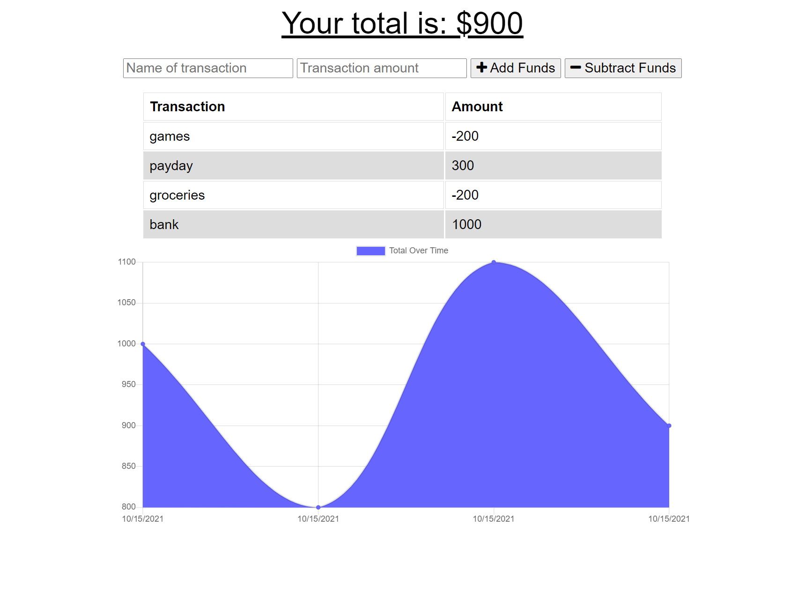

# Offline Budget Tracker

Adds offline capability to existing Budget Tracker application, making a Progressive Web Application.

## Links

[Deployed to Heroku](https://dry-badlands-47800.herokuapp.com/)

[Github Repository](https://github.com/kerilp/pwa-budget-tracker)

## Screenshots

## Contact

Email: [klprice128@gmail.com](mailto:klprice128@gmail.com)

GitHub: [https://github.com/kerilp](https://github.com/kerilp)